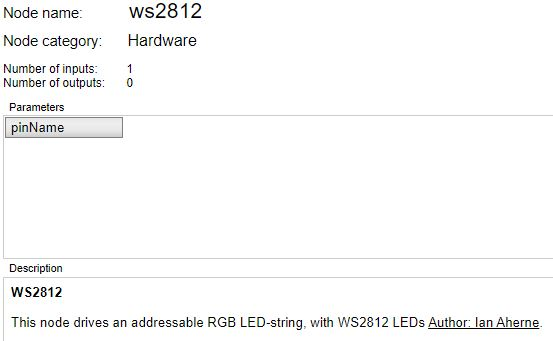

 # nBlocksStudio ws2812 
 ## NODE

---

 

---

To control the WS2812 intelligent control LED a single wire protocol is used
with a frequency of 800khz. The integrated Leds have a Green, Red, and blue section
in order to control the LEDs a 24 bit value is sent 8bits for green 8 for red and 8 for blue.
eg. 255,0,0 = green, 0,255,0 = red, 0,0,255 = blue. Values of each can be increased or decreased
to achieve a blend of colour and brightness.

For the WS2812 to distinguish between 1 and 0 in the single wire protocol the 
duty cycle of the transmission is varied.
                    0 code = high for 0.4us low for 0.8us
                    1 code = high for 0.8us low for 0.45us
                    
please note Data sheet timings are incorrect see adfruits website for correct timings.
                    
To achieve the high transmission rates a SPI hack is used using only the MOSI pin
without a clock, the SPI frequency is set at 2.4 Mhz triple the required frequency,
the SPI format is set to 12 bit packets.

To achieve the precise timing for 1 and 0 the followoing is sent at tripple the frequency 

                    0 code = 100
                    1 code = 110
                    
The above codes sent at 3 x 800Khz will replicate the the data sheet code timings 
and frees up the processor to do other things. Instead of sending 24 bits to light one LED
72 bits are sent at 3 times the frequency which to the appears to the WS2812 to be 24.

each SPI write is a 12 bit packet so 6 packets are sent consecutively to replicate
the 24 bits required to control the WS2812

Please note for correct operation a pull down resistor should be used on MOSI pin
this can not be set in firm ware using Mbed interface.

 Author: Ian Aherne  
